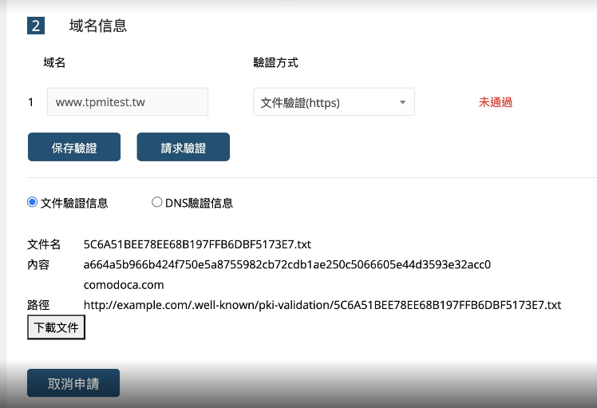

# 如何安裝 TenColor 網站的憑證


# SSH info
- fqdn: ec2-43-202-225-47.ap-northeast-2.compute.amazonaws.com
- ssh key: D:\.ssh\ten-color.pem

# 網站位置
- docker volume: /data/tencolor_web:/usr/share/nginx/html
- HTML PATH: /data/tencolor_web


# 憑證位置
- SSL 憑證
```
ssl_certificate     /data/nginx/conf.d/www.tpmitest.tw.crt;
ssl_certificate_key /data/nginx/conf.d/www.tpmitest.tw.key;
```

# 檢查憑證指令

- 查憑證期限
```
openssl x509 -in /data/nginx/conf.d/www.tpmitest.tw.crt -noout -dates
```
# 申請憑證

# 取得文件驗證訊息


內含
<驗證碼>
發行商網域: comodoca.com

# 建立驗證資料夾
mkdir -p /data/tencolor_web/.well-known/pki-validation

# 建立驗證檔

vi /data/tencolor_web/.well-known/pki-validation/<驗證碼>.txt
內容：
<驗證碼>
comodoca.com

# 調整 nginx
如 default.conf

重點
server {
   listen 80;
   server_name www.tpmitest.tw;

   location ^~ /.well-known/pki-validation/ {
      root /usr/share/nginx/html;
   }

   location / {
     return 301 https://$host$request_uri;
   }   
}

# Reload nginx
docker exec nginx nginx -s reload


# 測試是否可以讀取
curl http://www.tpmitest.tw/.well-known/pki-validation/5C6A51BEE78EE68B197FFB6DBF5173E7.txt
成功會得到
<驗證碼>
comodoca.com

